# DED Anonymizer v2 — Builder Deliverables Report (D1–D6)

Date: 2026-07-18. All file paths relative to `anonimizer_ded/` unless absolute.
Ground rules honored: spec/code disagreements are **recorded in the D3 ledger, never corrected in
place**; the core pipeline stayed transport-neutral; every module passed `py_compile` + an AST
scan (results table at the end).

---

## D1 — Run it and report

Two live runs (OpenAI, `ANON_MODEL=gpt-5.5`) plus one offline full-pipeline run with a duck-typed
mock client.

**Run A — real ΔΕΔ decision (`apodeltiosi/data/inputs/ΑΠΟΦΑΣΗ_ΓΙΑ_ΑΝΩΝΥΜΟΠΟΙΗΣΗ_τεστ.docx`), live LLM:**

| stage | result |
|---|---|
| parse | 211 text units, 0.079 s |
| detect | 498 candidate spans + 2,054 review hints, 0.125 s |
| llm | chunks 0–8 completed BOTH passes: spans located per chunk = 7, 86, 204, 2, 13, 107, 70, 68, 8 (= 565 llm spans before abort); per-chunk elapsed 15–154 s |
| chunk 9 pass 1 | **HTTP 429** → SDK retried twice → `AIProviderError: provider returned HTTP 429 (chunk 9, pass 1)` |
| exit status | runner exit **1** (processing failed), per design — the LLM stage is mandatory and any provider error aborts the document |

Exception chain (traceback suppressed by the runner's `except AnonymizerError` by design):
`openai.APIStatusError (HTTP 429)` → raised `from e` at `anonymizer/llm/detector.py::_call`
(APIStatusError branch) → `AIProviderError` → propagates uncaught through
`run_llm_detection` → `pipeline.anonymize_document` → caught at `run_anonymizer.py::main`.

**Root cause (probed directly):** the 429 body is `type=insufficient_quota` /
`code=insufficient_quota` — "You exceeded your current quota, please check your plan and billing
details." This is an **OpenAI account/billing condition, not a code defect**; a small-document
retry after 75 s cooldown also 429'd on its first call. No live run can complete until the
account is topped up.

**Run B — offline full pipeline, mock client (synthetic Greek ΔΕΔ-like DOCX):**
exit 0; summary `spans_total=8, by_action={'PRESERVE': 5, 'REDACT': 3}`; timings
`{parse: 0.0015, detect: 0.0077, llm: 0.0003, resolve: 0.0001, apply: 0.0008, total: 0.0103}`;
**QA status: postcheck `clean=True`, 0 findings**; 20/20 behavioral assertions passed
(details under D6). AFM/phone/name redacted with dot glyph; date, authority header, decision
metadata preserved.

**Blockers as delivered: none in code.** The only blocker to a complete live run is the exhausted
OpenAI quota (external). Historical import/call-time blockers (`_iter_allowlist_matches`,
`_body/_prefix` order, duplicate detectors module, flat layout) were all fixed in the prior
session and verified again here (see the scan table: 0 mismatches).

---

## D2 — Isolated, removable CLI runner (PowerShell)

**File created: `run_anonymizer.py`** (project root, next to `pyproject.toml`).

Isolation boundary (audited, ledger rows "D2 import isolation" / "D2 reverse isolation"):
- Imports ONLY public names: `load_runtime_config`, `load_file_config` (anonymizer.config),
  `build_client` (anonymizer.llm.client), `anonymize_document` (anonymizer.pipeline),
  `AnonymizerError`, `ConfigurationError` (anonymizer.errors),
  `scan_redacted_docx_bytes` (anonymizer.postcheck) + stdlib. Zero `_`-prefixed imports, zero
  private attribute access.
- Repo-wide grep: no pipeline module references `run_anonymizer` — deleting this one file removes
  the entire CLI surface with zero edits elsewhere; `anonymizer.api:app` is unaffected.

Exact PowerShell invocations (from the project root `anonimizer_ded/`):

```powershell
$env:ANON_PROVIDER = "openai"
$env:OPENAI_API_KEY = "<key>"
$env:ANON_MODEL = "<model>"

# one file
python .\run_anonymizer.py "C:\path\to\decision.docx"

# a folder of .docx (non-recursive), outputs to a chosen dir, with QA audit + JSON summaries
python .\run_anonymizer.py "C:\path\to\folder" --out-dir .\redacted --qa --summary-json
```

Exit codes: `0` all OK · `1` ≥1 document failed · `2` usage/no input · `3` configuration error ·
`4` all processed but `--qa` found HIGH residual findings.

---

## D3 — Deviation ledger

67 rows total from a 12-area audit (11 workflow auditors + 1 rerun after a stream timeout):
**18 pre-accepted deviations · 3 unexpected divergences · 21 PR-flags · 25 load-bearing
conformance confirmations.** Full table below; classification per the builder prompt.

### Unexpected divergences (3)

| item | spec says | code does | file:line | classification |
|---|---|---|---|---|
| `_find_by_element_path` empty-token handling | "return None on any invalid token or out-of-range index" — an empty token (`'/3//1'`) fails `int()` and should yield None | `if not token: continue` — empty tokens silently skipped, so `'/3//1'` resolves as `'/3/1'`. Inert in the pipeline (produced paths never contain empty tokens); literal contract difference for hand-crafted paths | anonymizer/docx_engine.py:120 | unexpected divergence |
| `clean_sensitive_parts` default for `removed_parts` | `removed_parts: set[str] \| None = None` with "add it to removed_parts" implies a caller-supplied set (incl. empty) is populated in place | `removed_parts = removed_parts or set()` — a passed-in EMPTY set is silently replaced, never populated. Latent: the only caller passes no argument and uses the return value | anonymizer/docx_engine.py:503 | unexpected divergence |
| postcheck location anchored at group-1 start | "location = the unit containing the match start (via the offset map)" | AFM/AMKA/case_ref_leak/person_name_leak call `locate(m.start(1))` (group-1 start). Identical for AFM/AMKA; for case_ref/person leaks a match spanning two units reports the unit holding the leaked value, not the match start | anonymizer/postcheck.py:124,129,136,199,217 | unexpected divergence |

### Pre-accepted deviations (18)

| item | spec says | code does | file:line | classification |
|---|---|---|---|---|
| `regex_patterns.yaml` phone keys | File must contain "exactly this content" incl. `phone_explicit`/`phone_bare` | Both keys absent (dead overrides removed; code reads `phone_intl/phone_local/phone_00` with `_DEFAULT_PATTERNS` fallback); other 7 entries byte-identical | config/regex_patterns.yaml:8-9 | pre-accepted deviation |
| `_body`/`_prefix` parameter order | task_04b: "implement `_body(name, rules)` / `_prefix(name, rules)`" | Rules-first `(rules, name)`; semantics identical; all 15 call sites match the shipped signatures | anonymizer/detector_support.py:66,71 | pre-accepted deviation |
| `_iter_allowlist_matches` exists | Helper absent from task_04b's helpers + owned-names lists | Defined (longest-first, escaped, IGNORECASE), in `__all__`, used by detectors.py:380,424 — was imported-but-missing historically | anonymizer/detector_support.py:78-88 | pre-accepted deviation |
| `_MEDICAL_TERMS` source | 04C/04D: define the 8-term set locally in detectors.py | Imported from detector_support (canonical in detector_patterns); identical set; usage matches spec exactly | anonymizer/detectors.py:23 | pre-accepted deviation |
| `_body`/`_prefix` call style in detectors | 04C shows fragments without accessor signature | All calls rules-first, matching shipped signatures | anonymizer/detectors.py:100 | pre-accepted deviation |
| Gazetteer matching via helper | "every IGNORECASE occurrence of each entry (escaped, longest-first)" inline | Via imported `_iter_allowlist_matches`, which implements exactly that | anonymizer/detectors.py:380 | pre-accepted deviation |
| `SYSTEM_PROMPT` → two pass prompts (D6) | task_06: "Define `SYSTEM_PROMPT: str`"; owned names incl. `SYSTEM_PROMPT` | No `SYSTEM_PROMPT`; shared `_PROMPT_CORE` + tails yield `SYSTEM_PROMPT_PASS1` (blind) and `SYSTEM_PROMPT_PASS2` (informed validation) | anonymizer/llm/prompts.py:116,124 | pre-accepted deviation |
| `build_pass2_message` signature/layout (D6) | 5-arg signature; "YOUR FIRST-PASS FINDINGS" + "RULE-BASED SUGGESTIONS" REDACT:/PRESERVE:/REVIEW: blocks | `build_pass2_message(chunk_text, known_spans)` — one uniform "KNOWN SPANS" JSON array of `{text, category, action, context}` | anonymizer/llm/prompts.py:153 | pre-accepted deviation |
| Pass-2 governing paragraph (D6) | System prompt paragraph naming the two old blocks | PASS2 tail: CONFIRM/CORRECT/DECIDE/ADD/DROP over KNOWN SPANS; "final decision for EVERY entry"; PASS1 tail states the blind contract | anonymizer/llm/prompts.py:124-141 | pre-accepted deviation |
| Pass-2 payload shape (D6) | Suggestions as `{text, category, context}` in three lists | `_suggestion()` emits uniform `{text, category, action, context}`; deterministic + review hints + located pass-1 findings concatenated into one `known_spans` list | anonymizer/llm/detector.py:339-350,481-492 | pre-accepted deviation |
| Pass-1 findings located for context (D6) | Findings passed as bare `{text, action, category}` dicts | New `_finding_known_span()` finds each text for a ±40-char context (payload-only; findings still never become Spans) | anonymizer/llm/detector.py:353-382 | pre-accepted deviation |
| `_call` signature + per-pass prompts (D6) | `_call(client, cfg, user_message, chunk_index, pass_number)` with single SYSTEM_PROMPT | `_call(..., system_prompt, ...)`; pass 1 gets PASS1, pass 2 gets PASS2 | anonymizer/llm/detector.py:389-396,474,489 | pre-accepted deviation |
| Category-first validation (D6) | task_07: action switch first, then category check | Category alias-resolved + validated FIRST; invalid-category entries can never trigger a coercion warning | anonymizer/llm/detector.py:261-278 | pre-accepted deviation |
| Coercion warning deferred (D6) | Warning logged at coercion time, unconditionally | Logged only if the coerced entry located ≥1 span (still category-only, never text) | anonymizer/llm/detector.py:272-275,313-314 | pre-accepted deviation |
| Per-chunk log field (D6) | "findings kept, suggestions sent, spans located" | `known_spans_sent` replaces the suggestions count; still counts+elapsed only | anonymizer/llm/detector.py:496-503 | pre-accepted deviation |
| pyproject packaging sections | Spec lists only `[project]` tables | Adds `[build-system]` + `[tool.setuptools.packages.find] include=["anonymizer*"]` (needed for `pip install -e .` with the `config/` data dir present) | pyproject.toml:1-3,25-26 | pre-accepted deviation |
| Docstrings on every def (D5) | Spec silent/implies bare defs | Every def now has a 1–2 sentence docstring; signatures byte-identical (verified by AST snapshot compare: 0 changes) | e.g. anonymizer/api.py:27-128 | pre-accepted deviation |
| CLI runner exists | task_09: HTTP-only surface, four deliverables, no CLI | `run_anonymizer.py` added per builder-prompt D2; isolation boundary verified (see D2) | run_anonymizer.py:1 | pre-accepted deviation |

### PR-flags (21) — human decision or spec-wording update needed; code left as-is

| item | spec says | code does | file:line | classification |
|---|---|---|---|---|
| dotenv load conditional | "First, attempt load_dotenv()" unconditionally | Nested under `if env is None:` so injected env mappings don't pick up `.env` side effects (commented rationale) | anonymizer/config.py:120-132 | PR-flag |
| `_require` empty-string handling | Only *missing* variables raise | `if not value:` — set-but-empty also raises (same message). Stricter than literal spec | anonymizer/config.py:93-95 | PR-flag |
| `.env.example` comment style | "one commented line per variable" | Grouped section comments; all 15 variables present with exact defaults/placeholders | .env.example:8-33 | PR-flag |
| `parse_docx` pre-validation | Spec's parse steps don't mention validation, but also forbid raising anything except the two typed errors | `parse_docx` calls `validate_docx_bytes` first so bad bytes surface as `InvalidDocumentError`, not `zipfile.BadZipFile` | anonymizer/docx_engine.py:175 | PR-flag |
| `column_header` index guard | Literal `header_texts[c]` would IndexError on ragged tables | Guarded lookup emits `""` instead of crashing on ragged tables (gridSpan/vMerge) | anonymizer/docx_engine.py:213 | PR-flag |
| Stale task_04b text | Spec still reads `(name, rules)` and omits `_iter_allowlist_matches` | Shipped approved state differs; **spec file should be rewritten** to match | task_04b_detector_support.md:32,64 | PR-flag |
| Dangling `_TABLE_HEADER_ACTIONS` comment | — | Import-block comment references a "module note below" that doesn't exist; constant actually lives in detectors.py:65 | anonymizer/detector_support.py:22-24 | PR-flag |
| Resolver defensive coercion | Sort/priority compare raw values | `_length`/`_confidence` helpers coerce with 0.0 fallback; identical for well-typed spans; diverges only on malformed input | anonymizer/resolver.py:14-24,171 | PR-flag |
| Prompt "Exception:" wording | task_06: "phone/fax candidates…" | Core reads "phone/fax **and names** candidates…(supervisor signature note)" — pre-existing divergence from the original generated build, carried over verbatim into `_PROMPT_CORE` (not silently reverted, per ground rules); also contains typos ("e.g at") | anonymizer/llm/prompts.py:77 | PR-flag |
| Unlocatable pass-2 "count it" | "A text found in no unit is dropped (count it; do not log it)" — but the count is never surfaced anywhere in the spec | No not-located counter (spec mandates dead state); entry dropped silently | anonymizer/llm/detector.py:282-314 | PR-flag |
| Apply-stage log field | Stage-count list omits apply | Logs `redacted_bytes=%d` — benign extra count, no content | anonymizer/pipeline.py:105-110 | PR-flag |
| `__future__` import | Not in pipeline.py's import allowlist | Needed for the spec's own `str \| None` syntax on older interpreters | anonymizer/pipeline.py:1 | PR-flag |
| 415/413 body shape | "every response body is {error, detail}" vs mandated bare HTTPException for 415/413 | Follows the letter: 415/413 use FastAPI default `{detail}` (README documents the asymmetry) | anonymizer/api.py:66,70,116-123 | PR-flag |
| Postcheck AFM ranges | "Record the matched ranges for the DIGIT_RUN exclusion" (AFM bullet) | No `afm_ranges` kept — DIGIT_RUN already skips all 9-digit runs by length, so recorded AFM ranges would be dead data | anonymizer/postcheck.py:116-117,167-179 | PR-flag |
| task_10b import lists contradict | Line 27 list (no `re`, has postcheck_support) vs lines 103-105 list (has `re`, omits postcheck_support) | Code imports the union (+ benign `__future__`); spec lists need reconciling | anonymizer/postcheck.py:9-37 | PR-flag |
| Final-signatory "skip" semantics | "skip a candidate when …already preserved" | Private-cue skip = `continue`; already-preserved = `break` (abandons remaining candidates for that title) — two "skips" behave differently | anonymizer/detectors.py:868 | PR-flag |
| Review-candidates regex flags | Spec silent on flags; patterns rely on capitalization | Passed without flags → `_regex_spans` defaults to IGNORECASE, nullifying the capitalization constraint (lowercase pairs also match) for greek_name_shape/company_suffix/street_shape | anonymizer/detectors.py:758 | PR-flag |
| `company_suffix` trailing `\b` | Spec quotes the alternation without boundary placement | Code appends `\b` after the suffix; `\b` can't match after a final "." — dot-terminated forms (Α.Ε., Ε.Π.Ε., Ο.Ε., Ι.Κ.Ε.) followed by space/EOL never match. **Probable regex bug**; recorded, not fixed | anonymizer/detectors.py:771 | PR-flag |
| DOU prefix flags | IGNORECASE stated only for the allowlist match step | `_DOU_PREFIX_RE` compiled IGNORECASE → lowercase "δου" also triggers | anonymizer/detectors.py:57 | PR-flag |
| `_split_serial_date` None fallback | Spec never defines the None (ambiguous) case | Full captured value treated as the serial and component-split (also in challenged-acts) | anonymizer/detectors.py:234,286-287 | PR-flag |
| task_04d closing import list stale | Closing paragraph names `datetime` + `stdnum.iban`, omits `detector_support` | Code follows the earlier (correct) list; datetime/stdnum correctly live in detector_support per the 04B split | anonymizer/detectors.py:8 | PR-flag |

### Load-bearing conformance confirmations (25, summarized)

38-category SpanCategory partition + `ALL_CATEGORIES`; all negative constraints in models/errors
(no `source_path`, no QA types, no methods); policy.yaml byte-equivalent (thresholds 0.8/0.9/0.7,
13+4 hard categories, no `review_threshold`); allowlists populated per instruction (58/55/28
lines, verbatim from v1); per-character NFC (offset-map invariant) exact; byte-fidelity ZIP
write-back exact (8 ZipInfo fields); detector_patterns byte-for-byte VERBATIM (7245/7245 chars);
AFM/AMKA/IBAN validators + stdnum guard exact; resolver REVIEW guard with byte-exact message;
priority tiers 6/5/4/3/0 + `_STRUCTURED_REDACT_CATEGORIES` + four hard-flag rules in spec order;
`build_client` exact (no max_retries, no abstractions); pass-1 blindness contract exact
(`"DOCUMENT EXCERPT:\n" + chunk_text`, stdlib json only); SDK error translation order + exact
messages; `_CATEGORY_ALIASES` verbatim (21 entries); review_hints never reach the resolver;
pipeline invariant-1 + no-catch policy; api status mapping (400/422/502/503/503/504) + fixed 500
body; gunicorn.conf.py character-identical; task_10a support module verbatim + only-`re` import;
postcheck negative constraints (no PASS/FAIL enum, bytes-only API, no logging, detail never
echoes text except the two allowed kinds); detect_all pass order + strict action split;
`_TABLE_HEADER_ACTIONS` all 16 entries exact; CLI import isolation + reverse isolation.

---

## D4 — Mermaid data-flow diagram

```mermaid
flowchart TD
    IN(["Input: DOCX bytes"])

    subgraph STARTUP["Startup (once)"]
      CFG["config.py::load_runtime_config() + load_file_config('config/')<br/>llm/client.py::build_client()"]
    end

    CLI["run_anonymizer.py::main()<br/>(removable CLI — PowerShell)"]
    API["api.py::anonymize()  POST /anonymize<br/>(payload via _read_payload(): multipart 'file' or raw body)"]

    IN -->|"bytes (file/folder read)"| CLI
    IN -->|"bytes (HTTP upload)"| API
    CFG -.->|"RuntimeConfig + FileConfig + client"| CLI
    CFG -.->|"RuntimeConfig + FileConfig + client (api.py::lifespan())"| API

    CLI -->|"bytes + config + files + client"| VAL
    API -->|"bytes + config + files + client"| VAL

    subgraph PIPE["pipeline.py::anonymize_document() — transport-neutral core"]
      VAL["docx_engine.py::validate_docx_bytes()"] -->|"validated bytes"| PARSE
      PARSE["docx_engine.py::parse_docx()"] -->|"DocumentData (TextUnits + char_map: list[XmlCharRef])"| DET
      DET["detectors.py::detect_all()"] -->|"DetectionResult.review_hints: list[Span] (REVIEW — LLM input ONLY)"| P1
      DET -->|"DetectionResult.resolver_spans: list[Span] (REDACT/PRESERVE)"| P1

      subgraph LLM["llm/detector.py::run_llm_detection() — sequential, per chunk (split_into_chunks())"]
        P1["_call(SYSTEM_PROMPT_PASS1, build_pass1_message())<br/>PASS 1 — BLIND (raw excerpt only)"] -->|"JSON → parse_pass1_findings(): list[dict] (never Spans)"| KS
        KS["_suggestion() + _finding_known_span()<br/>KNOWN SPANS assembly"] -->|"known_spans: list[{text,category,action,context}]"| P2
        P2["_call(SYSTEM_PROMPT_PASS2, build_pass2_message())<br/>PASS 2 — INFORMED VALIDATION (confirm/correct/add)"] -->|"JSON → parse_pass2_spans(): category-first validation"| LS["llm spans: list[Span] detector='llm_pass2'"]
      end

      LS -->|"list[Span]"| RES
      DET -->|"resolver_spans (bypass LLM — merge: llm_spans + resolver_spans)"| RES
      RES["resolver.py::resolve_redactions()<br/>char-ownership, priority 6/5/4/3/0 + hard flags"] -->|"RedactionPlan (REDACT/PRESERVE only)"| APPLY
      APPLY["docx_engine.py::write_redacted_docx()<br/>apply_plan() dot-glyph via char_map + clean_sensitive_parts()"] -->|"redacted bytes (byte-verbatim ZIP)"| SUM
      SUM["summary.py::build_summary()"] -->|"AnonymizeResult (bytes + counts-only PlanSummary + timings)"| OUT
    end

    OUT{"AnonymizeResult"}
    OUT -->|"redacted_docx: bytes → <stem>_redacted.docx"| FCLI["CLI output file(s)"]
    OUT -->|"docx attachment, or ?summary=1 JSON {document_id, summary, warnings, model, docx_base64}"| FAPI["HTTP 200 response"]

    OUT -.->|"--qa (optional, out-of-band)"| QA["postcheck.py::scan_redacted_docx_bytes()"]
    QA -.->|"PostcheckSummary (residual-leak findings)"| FCLI

    FCLI --> XC["CLI exit codes:<br/>0 = all OK · 1 = ≥1 document failed (AnonymizerError)<br/>2 = usage/no .docx input · 3 = ConfigurationError · 4 = --qa HIGH findings"]
    FAPI --> XH["HTTP statuses:<br/>200 OK · 400 InvalidDocumentError · 413 too large · 415 bad content-type<br/>422 DocumentProcessingError · 502 AIProviderError · 503 ConfigurationError/AIUnavailableError<br/>504 AITimeoutError · 500 unexpected (fixed body, no detail leak)"]

    classDef opt stroke-dasharray:5 5
    class QA opt
```



Edge notes: `review_hints` reach ONLY pass 2 (never the resolver — enforced by a RuntimeError
guard); `resolver_spans` travel BOTH paths, so the LLM cannot suppress a deterministic detection;
only pass-2 output becomes spans; the resolver is the single final authority.

---

## D5 — Docstrings on every def

Before: 81 defs lacking docstrings across 9 files (config 6, docx_engine 28, detector_support 7,
detectors 19, resolver 9, api 6, postcheck_support 1, postcheck 4, llm/client 1). After the
sweep: **0 missing across all 20 modules** (llm/prompts.py, llm/detector.py, run_anonymizer.py
were authored with full coverage). Non-destructiveness proven mechanically:
**0 signature changes** vs the pre-sweep AST snapshot, 0 call-signature mismatches, all modules
compile and import, and the full offline pipeline run repeated ALL PASS after the sweep.
No public name was renamed or moved.

---

## D6 — Two-pass LLM detection: blind pass + informed second pass

**Regenerated in full (authoring-source edit, not a patch):** `anonymizer/llm/prompts.py` and
`anonymizer/llm/detector.py`.

**Owned system-prompt constants:** `SYSTEM_PROMPT_PASS1` (blind: raw excerpt only, propose from
scratch) and `SYSTEM_PROMPT_PASS2` (informed validation: confirm / correct / decide-REVIEW / add /
drop over the KNOWN SPANS block). Both are built from one shared `_PROMPT_CORE` so the category
schema can never drift between passes. The old single `SYSTEM_PROMPT` no longer exists.

**Functions changed:**
- `prompts.build_pass2_message` — new signature `(chunk_text, known_spans)`; emits one uniform
  "KNOWN SPANS" JSON array of `{text, category, action, context}`.
- `detector._call` — gained a `system_prompt` parameter (pass-specific prompt selection).
- `detector._suggestion` — now includes `"action"` so deterministic spans share the uniform shape.
- `detector._finding_known_span` — NEW: locates each pass-1 finding in the chunk for a ±40-char
  context window (payload-only; pass-1 findings still never become `Span` objects).
- `detector.parse_pass2_spans` — **category validated first, before the action switch**; the
  REVIEW→REDACT coercion warning now fires only for entries that survive validation AND locate at
  least one span.
- `detector.run_llm_detection` — assembles the single known-spans list (deterministic
  REDACT/PRESERVE + REVIEW hints + located pass-1 proposals) and passes the per-pass prompts;
  log field `known_spans_sent`.

**Unchanged:** `Chunk`, `split_into_chunks`, `_extract_json_array`, `parse_pass1_findings`,
`_span_context`, the SDK error translation, `__all__`, and `run_llm_detection`'s public signature
(so `pipeline.py` needed no edit).

**Validation (offline, duck-typed mock client, full pipeline):** 20/20 assertions —
pass-1 blind purity (correct system prompt, no suggestion blocks); pass-2 uses PASS2 prompt with
a parseable KNOWN SPANS array whose every entry is exactly `{text, category, action, context}`;
deterministic REVIEW hints and the alias-resolved pass-1 proposal (with real surrounding context)
both present; exactly ONE coercion warning (the locatable valid-category REVIEW), none for the
invalid-category or unlocatable REVIEW entries; correct redact/preserve behavior in the output
DOCX; postcheck clean. Live model behavior remains unverifiable until the OpenAI quota is topped
up (D1).

---

## Per-module `py_compile` + AST scan results

Scan = `py_compile` + real import + docstring coverage + cross-module call-signature check
(positional counts + keyword names vs each callee's def — the check class that would have caught
the historical `_body(rules, name)` reversal) + def-signature snapshot comparison across the D5
sweep. `pyflakes` was not installed and not added (no-new-dependencies rule); the import check
covers module-scope undefined names.

| module | py_compile | import | defs | missing docstrings | sig changes vs snapshot |
|---|---|---|---|---|---|
| anonymizer/__init__.py | OK | OK | 0 | 0 | 0 |
| anonymizer/models.py | OK | OK | 0 | 0 | 0 |
| anonymizer/errors.py | OK | OK | 0 | 0 | 0 |
| anonymizer/config.py | OK | OK | 7 | 0 | 0 |
| anonymizer/docx_engine.py | OK | OK | 28 | 0 | 0 |
| anonymizer/detector_patterns.py | OK | OK | 0 | 0 | 0 |
| anonymizer/detector_support.py | OK | OK | 11 | 0 | 0 |
| anonymizer/detectors.py | OK | OK | 19 | 0 | 0 |
| anonymizer/resolver.py | OK | OK | 10 | 0 | 0 |
| anonymizer/summary.py | OK | OK | 1 | 0 | 0 |
| anonymizer/pipeline.py | OK | OK | 1 | 0 | 0 |
| anonymizer/api.py | OK | OK | 6 | 0 | 0 |
| anonymizer/postcheck_support.py | OK | OK | 4 | 0 | 0 |
| anonymizer/postcheck.py | OK | OK | 4 | 0 | 0 |
| anonymizer/llm/__init__.py | OK | OK | 0 | 0 | 0 |
| anonymizer/llm/client.py | OK | OK | 1 | 0 | 0 |
| anonymizer/llm/prompts.py | OK | OK | 2 | 0 | 0 |
| anonymizer/llm/detector.py | OK | OK | 11 | 0 | 0 |
| run_anonymizer.py | OK | OK | 5 | 0 | 0 |
| gunicorn.conf.py | OK | n/a (compile-only) | 0 | 0 | 0 |

**Cross-module call-signature mismatches: 0.**

## Statically unverifiable

Live two-pass model behavior/latency and end-quality on real documents (OpenAI quota exhausted —
`insufficient_quota`); whether `gpt-5.5` follows the new KNOWN SPANS contract as well as the old
three-block layout (the mock validates plumbing, not model quality); redaction recall/precision
vs gold data.
